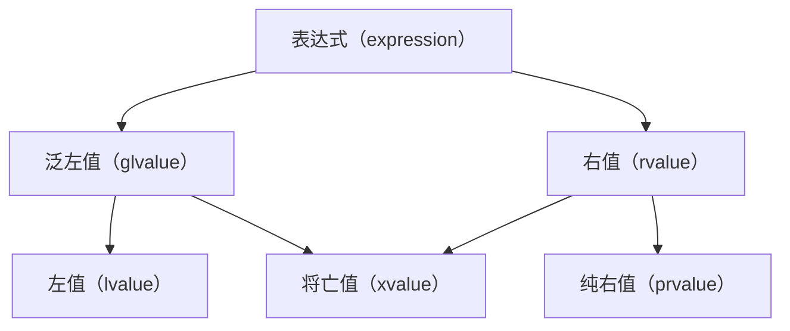

# 值类别

## 右值

C++ 中左值与右值的概念在 c++98 时期就出现了。左值一般是指一个指向特定内存的具有名称的值，具有一个稳定的内存地址。右值指向不稳定内存地址的匿名值，通常是暂时的，生命周期很短。

有一个很简单的判断方法，使用 `&` 取值后，可以正常编译取到地址的就是左值。一般左值与右值还是很好分辨的，但也有一些特例

- `++i` 与 `i++`：`++i` 是左值，返回的变量是 i，具有稳定的内存地址；`i++` 是右值，返回的是对原来 i 的一个副本
- 函数：函数形参是左值，但返回值是右值
- 字面量：一般数值的字面量都是右值，但字符串字面量是左值 - 字符串有一个连续的字符数组存储，具有稳定的内存地址

值类别是 C++11 引入的新概念，用于描述表达式的属性，并于 C++17 进行了清晰的区分：


- 泛左值：通过评估能确定对象、位域或函数的标志的表达式，即具名对象，C++98的左值
- 右值：即 C++98的右值
- 将亡值：表示资源可被重用的对象和位域，泛左值与右值的交集
	- 使用类型转换将泛左值转换为右值引用，详见[[#std::move]]
	- 临时量实质化：纯右值转换为临时对象（c++17）

```c++
struct S {
    int a;
};

int main() {
    // S() 产生一个右值（纯右值）
    // 访问成员四 a 需要一个左值
    // 此时将创建 S() 临时变量，该量为将亡值
    int b = S().a;
}
```

- 纯右值：通过评估能用于初始化对象和位域，或能计算运算符操作数的值的表达式
- 左值：非将亡值的泛左值

> [!note]
> 在笔记后面内容中，“左值” 指值类别为泛左值的表达式，“右值” 指值类别为右值的表达式
## 右值引用

对于左值的引用类型，可以使用 `&` 表示：

```c++
int i = 0;
int &j = i;
```

对于右值的引用类型，使用 `&&` 表示：

```c++
int &&k = 11;
```

右值引用的作用是延长右值的存在时间。一般来说，右值在使用后直接销毁；而存在右值引用时，直到引用被销毁后右值才被销毁。

右值引用的一个用处是减少对象复制构造的调用。

```c++
#include <iostream>

using namespace std;

class X {
public:

    X() {
        cout << "X 默认构造\n";
    }

    X(const X& x) {
        cout << "X 复制构造\n";
    }

    void show() {
        cout << "Show X\n";
    }
};

X make_x() {
    X x;
    return x;
}

int main() {
    X x = make_x();
    x.show();
    return 0;
}
```

以上代码在 `X x = make_x()` 时产生了三次构造函数调用
1. `X x;` 调用无参构造创建对象
2. `return x;` 调用复制构造创建用于返回的临时变量
3. `X x = ...` 调用复制构造将临时变量复制给 x 变量

> [!note]
> 测试平台 g++.exe (x86_64-posix-seh-rev1, Built by MinGW-Builds project) 13.2.0
> 
> 使用了 `-fno-elide-constructors` 配置选项，经测试实际只调用了两次构造，可能新平台有其他优化

将 main 函数中 x 的类型更改为 `X&&`，如：

```c++
// ...

int main() {
    X &&x = make_x();
    x.show();
    return 0;
}
```

之后调用只会产生两次构造。x 接收的是一个右值引用，延长了 `make_x()` 产生的右值的生命周期，不需要通过复制构造产生第二个对象。
# 移动语义
## 移动构造

C++11 引入了一种新构造函数 - 移动构造。移动构造用于将数据从一个对象移动到另一个对象 -- 而不是类似复制构造一样的进行完整的内存复制。

```c++
class Str {
private:
    int len;
    char *str;
    
public:
    
    // 构造函数
    Str(const char* string) {
        len = strlen(string);
        str = new char[len];
        memcpy(str, string, len * sizeof(char));
    }
    
    // 复制构造
    Str(const Str &o) {
        len = o.len;
        // 进行完整的数据复制
        str = new char[len];
        memcpy(str, o.str, len * sizeof(char));
    }
    
    // 移动构造
    Str(Str &&o) {
        len = o.len;
        // 只进行数据移动
        str = o.str;
        // 清空原数据，避免出现问题
        o.len = 0;
        o.str = nullptr;
    }
};
```

对于将右值向左值赋值，C++ 优先调用移动构造，无移动构造则调用复制构造

```c++
class TestA {
public:
    TestA() {}

    TestA(const TestA &a) {
        cout << "复制构造\n";
    }

    TestA(TestA &&a) {
        cout << "移动构造\n";
    }

    void show() {
        cout << "show\n";
    }
};

TestA make_a() {
    TestA a;
    return a;
}

int main() {
    // 移动构造
    TestA a = make_a();
    // show
    a.show();
    return 0;
}
```

在特定情况下，C++ 可以生成默认移动构造函数：
- 无复制函数，包括复制构造函数和复制赋值函数
- 无移动函数，包括移动构造函数和移动赋值函数
- 无析构函数
## std::move

C++无法将一个右值赋给左值引用的变量。但可以将一个左值通过强制转换为一个将亡值，而将亡值也同时属于右值，此时可以将其赋给一个右值引用。此时该变量与之前的变量有相同的生命周期和内存地址。

```c++
int i = 10;
int &&k = static_cast<int&&>(i);
```

在标准库中，提供 `std::move` 模板函数用于实现该功能，将一个左值转换为右值（将亡值）。

该功能的作用主要是使一个左值使用移动语义：

```c++
// 一个具有移动构造的类型，包含一块内存数据的指针
BigMemoryPool value;
// 该操作调用的是 BigMemoryPool 的复制构造 
BigMemoryPool value1 = value;
// 该操作调用的是 BigMemoryPool 的移动构造 
BigMemoryPool value2 = std::move(value);
```

使用场景为在一个右值被转换为左值，又需要再次转换为右值的情况，尤其是在函数调用的情况 -- 无论函数形参是左值还是右值，传入的实参都是左值。
## 隐式转换为移动构造

新版本 c++ 会将一些曾经使用复制构造的地方转而使用移动构造以提高效率。

```c++
struct X;

X f(X x) {
    return x;
}

int main() {
    X r = f(X{});
}
```

老版本 c++ 中，将  `f()` 的结果赋值给 `r` 的过程调用的是复制构造。c++11 会将其优化为使用移动构造。

c++20 对右值引用和 `throw` 进行扩展。该标准规定以下情况可以采用移动代替复制：
- `return`，`co_return` 返回的对象是函数或 lambda 表达式中的对象或形参
- `throw` 抛出的对象是 `try` 块中的对象
# 完美转发
## 万能引用

`const T&` 可以同时匹配左值和右值引用。但由于其 `const` 限制，使用场景有一定的限制。C++11 允许使用模板+ `T&&` 匹配所有类型引用，称为万能引用：

```c++
//  万能引用
template<typename T>
void foo(T&& v) {
    // do something
}

int main() {
    int i = 5;
    // 匹配左值引用
    foo(static_cast<int&>(i));
    // 匹配右值引用
    foo(static_cast<int&&>(i));
    return 0;
}
```

万能引用主要是通过引用折叠实现：
- 只要有一个左值引用，结果就是左值引用
- 当一个是右值引用，另一个是非引用或右值引用，结果是右值引用

| T | T& | T&& |
| ---- | :--- | :--- |
| R | R& | R&& |
| R& | R& | R& |
| R&& | R& | R&& |
## 完美转发

万能引用的最常用使用场景是完美转发。

```C++
class Value {
public:
    Value() {
        cout << "普通构造\n";
    }

    Value(const Value& v) {
        cout << "复制构造\n";
    }

    Value(Value&& v) {
        cout << "移动构造\n";
    }

    void show() {
        cout << "show\n";
    }
};

template<typename T>
void show(T v) {
    v.show();
}

template<typename T>
void forward(T v) {
    show(v);
}

int main() {
    // 普通构造
    // 移动构造
    // 复制构造
    // show
    forward(get_value());
    return 0;
}
```

以上代码演示了将一个右值（`get_value()` 返回的值）通过一个函数（`forward`）传递给实际应用的函数（`show`）。该过程在 `forward` 到 `show` 函数之间执行了一次复制构造，当对象较大时会产生额外的性能损失。

```c++
template<typename T>
void show(const T& v) {
    v.show();
}

template<typename T>
void forward(const T& v) {
    show(v);
}
```

上面代码中将变量类型更改为 `const T&` 可以解决这个问题，因为常量左值引用可以引用右值。但在此例中行不通 - `show` 函数不是 `const` 的，这是常量引用的一些限制。

```c++
template<typename T>
void show(T&& v) {
    v.show();
}

template<typename T>
void forward(T&& v) {
    show(static_cast<T&&>(v));
}
```

使用完美转发可以解决这个问题。右值传入 `forward` 后成为左值，然后将其再次转换为右值传入 `show` 中调用即可。此时复制构造的调用被消除了。

标准库提供 `std::forward` 方法用于实现完美转发。其作用是将左值转换成右值形式（将亡值）。其具体实现就是一个 `static_cast` 转换。

```c++
template<typename T>
void forward(T&& v) {
    show(std::forward<T>(v));
}
```
