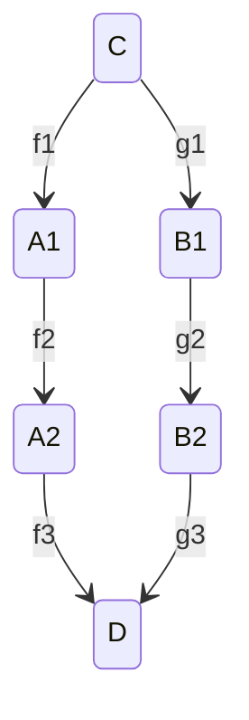

# 集合与映射

> 恒等映射：若 $f:A\rightarrow A$ 定义为 $f(x)=x$，则称 $f$ 为 $A$ 的恒等映射，记为 $id_A$

> 嵌入：若集合 $A_0\subseteq{A}$，存在映射 $i:A_0\rightarrow A$，$\forall x\in{A_0}$，有 $i(X)=X$，称 $i$ 为嵌入映射；当 $A_0=A$ 时，映射 $i$ 是恒等映射

嵌入映射实际是值域的扩大

> 开拓与限制：若集合 $A_0\subseteq{A}$，$f:A_0\rightarrow B$，$g:A\rightarrow B$，使 $\forall x\in{A_0}$，$g(x)=f(x)$，则称 $g$ 为 $f$ 的开拓（映射），$f$ 为 $g$ 在 $A_0$ 上的限制（映射）

开脱实际是定义域的扩大，限制是定义域的缩小

> 映射交换图：若存在集合 $C$，$D$，若从 $C$ 到 $D$ 的映射关系 $f_3f_2f_1=g_3g_2g_1$ 对每个元素 $x\in{C}$ 都成立，则称以下图为映射交换图：

>笛卡尔直积：若存在集合 $A$，$B$，$A\times B=\{(x,y)|x\in{A},y\in{B}\}$ 

# 运算

> 运算：映射 $f:A\times B\rightarrow D$ 即 $A$ 与 $B$ 到 $D$ 的一个运算

> 二元运算：$f:A\times A\rightarrow A$ 决定了 $A$ 中的一个二元运算

运算律
- 结合律：**基本**，大多数运算都满足结合律，使 $a^n$ 这种符号有意义
- 交换律：使 $(ab)^m=a^mb^m$ 成立
- 分配率
- 消去律

> 幺元律：在集合 $N$ 中定义运算 $\cdot$，$\exists i\in{N}$，对于 $\forall x\in{N}$，有 $i\cdot x=x\cdot i=x$，称 $i$ 为 $N$ 中关于运算 $\cdot$ 的一个幺元，$\cdot$ 运算符合幺元律

> 逆元律：在集合 $N$ 中定义运算 $\cdot$ 存在幺元 $i$，若对于 $\forall \psi\in{N}$，$\exists \Psi\in{N}$，有 $\psi\cdot\Psi=\Psi\cdot\psi=i$，则该运算满足逆元律，$\psi$ 为 $\Psi$ 的逆元，$\Psi$ 为 $\psi$ 的逆元

# 关系

> 二元关系：集合 $A$ 中，$R\subseteq{A\times A}$，$\forall a,b\in{A}$，若 $(a,b)\in{R}$，称 a，b 有关系，记为 $aRb$ 或 $a$，否则称 a，b 无关系，记为 $a\not{R}b$，R 为 A 的一个二元关系，简称关系

> 等价关系：集合内满足自反性性、对称性、传递性的关系

> 分划（分类）：集合 $A$ 中的子集合满足 $A=\bigcup_{i\in{I}}{A_i}$，且对任意 $i,j\in{I}$，$A_i\cap{A_j}=\emptyset$，称 $A_i,i\in{I}$ 为 $A$ 的一个分类

A 的分类是 A 的不相交的并

*集合 A 的一个分类决定了 A 的一个等价关系，集合 $A$ 的等价关系决定 $A$ 的一个分划*

> 等价类：集合 $A$ 的一个等价关系 $R$，若 $a\in{A}$，则所有 $iRa$ 的元素 $i$ 的集合组成了 $a$ 的一个等价类，记作 $\bar a$，$a$ 称为该等价类的一个代表元

> 商集合：集合 $A$ 的等价关系 $R$ 的所有等价类的集合称为 $A$ 关于 $R$ 的商集合，记作 $\dfrac{A}{R}$

*$A$ 中元素 $a$ 关于 $R$ 的等价类 $\bar a$ 是 $A$ 的一个子类，是集合 $\dfrac{A}{R}$ 的一个元素*

*等价的元素所在的等价类相同，同一个等价类可以有多个不同的代表元*

> 自然映射：将集合 $A$ 转换到 $\dfrac{A}{R}$ 的映射称为自然映射，记作 $\pi$，$\pi(a)=\bar a$

自然映射是满射，不一定是单射

# 同余关系

> 保持：集合 $A$ 的一个关系 $\sim$，$\cdot$ 是 $A$ 上的一个二元关系，若满足 $\left.\begin{matrix}a\sim b\\ c\sim d \end{matrix}\right\}\Rightarrow a\cdot c\sim b\cdot d$，称 $\sim$ 关系在 $\cdot$ 运算下被保持

> 同余关系：集合 $A$ 的一个等价关系 $\sim$，$\cdot$ 是 $A$ 上的一个二元运算，且 $\sim$ 在 $\cdot$ 运算下被保持，称 $\sim$ 是 $A$ 中对运算 $\cdot$ 的一个同余关系

# 商集合的运算

在集合 $A$ 中存在一个关系 $R$ 和一个 运算 $\cdot$，满足 $R$ 是 $A$ 中对运算 $\cdot$ 的一个同余关系，则在集合 $\dfrac{A}{R}$ 中定义运算 $\bar\cdot$，使得 $\bar a \bar \cdot\bar b\equiv\overline{a\cdot b}$
