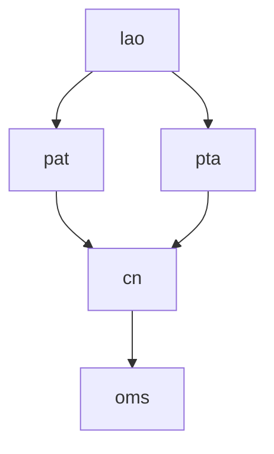
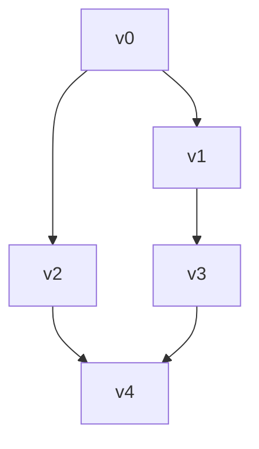

> 2022年天梯赛真题
> https://pintia.cn/problem-sets/1648134818082430976/exam/overview

难度/题目：7-13 分数 30
# 题目

![[Pasted image 20240219115408.png]]

人类喜欢用 10 进制，大概是因为人类有一双手 10 根手指用于计数。于是在千手观音的世界里，数字都是 10 000 进制的，因为每位观音有 1 000 双手 ……

千手观音们的每一根手指都对应一个符号（但是观音世界里的符号太难画了，我们暂且用小写英文字母串来代表），就好像人类用自己的 10 根手指对应 0 到 9 这 10 个数字。同样的，就像人类把这 10 个数字排列起来表示更大的数字一样，ta们也把这些名字排列起来表示更大的数字，并且也遵循左边高位右边低位的规则，相邻名字间用一个点 `.` 分隔，例如 `pat.pta.cn` 表示千手观音世界里的一个 3 位数。

人类不知道这些符号代表的数字的大小。不过幸运的是，人类发现了千手观音们留下的一串数字，并且有理由相信，这串数字是从小到大有序的！于是你的任务来了：请你根据这串有序的数字，推导出千手观音每只手代表的符号的相对顺序。

注意：有可能无法根据这串数字得到全部的顺序，你只要尽量推出能得到的结果就好了。当若干根手指之间的相对顺序无法确定时，就暂且按它们的英文字典序升序排列。例如给定下面几个数字：

```
pat
cn
lao.cn
lao.oms
pta.lao
pta.pat
cn.pat
```

我们首先可以根据前两个数字推断 `pat` < `cn`；根据左边高位的顺序可以推断 `lao` < `pta` < `cn`；再根据高位相等时低位的顺序，可以推断出 `cn` < `oms`，`lao` < `pat`。综上我们得到两种可能的顺序：`lao` < `pat` < `pta` < `cn` < `oms`；或者 `lao` < `pta` < `pat` < `cn` < `oms`，即 `pat` 和 `pta` 之间的相对顺序无法确定，这时我们按字典序排列，得到 `lao` < `pat` < `pta` < `cn` < `oms`。
## 输入格式

输入第一行给出一个正整数 N (≤$10^5$)，为千手观音留下的数字的个数。随后 N 行，每行给出一个千手观音留下的数字，不超过 10 位数，每一位的符号用不超过 3 个小写英文字母表示，相邻两符号之间用 `.` 分隔。

我们假设给出的数字顺序在千手观音的世界里是严格递增的。题目保证数字是 $10^4$ 进制的，即符号的种类肯定不超过 $10^4$ 种。
## 输出格式

在一行中按大小递增序输出符号。当若干根手指之间的相对顺序无法确定时，按它们的英文字典序升序排列。符号间仍然用 `.` 分隔。
## 样例
### 输入

```
7
pat
cn
lao.cn
lao.oms
pta.lao
pta.pat
cn.pat

```
### 输出

```
lao.pat.pta.cn.oms

```
## 代码限制

代码长度限制：16 KB

Java (javac)
时间限制：600 ms
内存限制：128 MB

Python (python3)
时间限制：500 ms
内存限制：64 MB

其他编译器
时间限制：200 ms
内存限制：64 MB

栈限制：8192 KB
# 思路

根据两个长度相同的相邻输入可以判断两个单词的大小。根据此创建图，存储比单词 k 更大的单词，因为要从最小值开始找比他更大的值。

| 输入 | 可推论大小 | 图 |
| ---- | ---- | ---- |
| pat |  |  |
| cn | pat < cn | pat: {cn} |
| lao.cn |  |  |
| lao.oms | cn < oms | cn: {oms} |
| pta.lao | lao < pta | lao: {pta} |
| pta.pat | lao < pat | lao: {pta, pat} |
| cn.pat | pta < cn | pta: {cn} |
图形化后为：


建图时记录每个节点的出度，每次输出出度为 0 并将其连接的节点出度 -1，循环输出即可。

该题难点在于：

- 环可能会出现这种情况：



此时，`v1` 与 `v2`、`v3` 节点的大小均无法判断，都需要按字典序排序，即应当先输出 `v2`、`v3` 字典序最小的，然后再输出 `v2`、`v1` 最小字典序或 `v3` -> `v1` 

- 该题时间卡的很紧，而且输入的字符串也有问题：
	- 需要手动分割输入的字符串，不能用 `string::find` 方法，否则会 TLE 和堆错误
	- 需要使用堆进行字典序排序，不能用 `set`
	- 需要使用字符串的离散化
# 答案

```c++
#include<iostream>  
#include<string>  
#include<unordered_map>  
#include<list>  
#include<set>  
#include<vector>  
#include<queue>  
  
using namespace std;  
const int MAX_SIZE = 100010;  
  
int n;  
  
// 记录下一节点和入度的图 (小->大)  
struct Graph {  
    int in_deg_record[MAX_SIZE]{0};  
    list<int> stl_record[MAX_SIZE];  
  
    // 节点  
    list<int> &operator[](int i) {  
        return stl_record[i];  
    }  
  
    // 入度  
    int &in_deg(int i) {  
        return in_deg_record[i];  
    }  
  
    // 连接  
    void link(int v0, int v1) {  
        stl_record[v0].push_front(v1);  
        in_deg_record[v1]++;  
    }  
} graph;  
  
// 离散化字符串  
struct ID {  
    unordered_map<string, int> sti;  
    string its[MAX_SIZE];  
    int next = 0;  
  
    string &operator[](int i) {  
        return its[i];  
    }  
  
    int operator[](const string &s) {  
        if (sti.count(s)) return sti[s];  
        sti[s] = next;  
        its[next] = s;  
        return next++;  
    }  
} ids;  
  
void split(list<int> &sub, const string &s) {  
    sub.clear();  
  
    int cnt = 0;  
    for (int j = 0; j < s.size(); j++) {  
        if (s[j] == '.') {  
            string t = s.substr(j - cnt, cnt);  
            sub.push_back(ids[t]);  
            cnt = 0;  
        } else if (j == s.size() - 1) {  
            string t = s.substr(j - cnt, cnt + 1);  
            sub.push_back(ids[t]);  
        } else {  
            cnt++;  
        }  
    }  
}  
  
int main() {  
    cin >> n;  
    cin.ignore();  
    // 1. 拆分读入字符串，建图  
    list<int> v0, v1;  
    for (int i = 0; i < n; ++i) {  
        string s;  
        getline(cin, s);  
        v0 = v1;  
        v1 = {};  
        split(v1, s);  
        if (v0.size() != v1.size()) continue;  
        for (auto p0 = v0.begin(), p1 = v1.begin(); p0 != v0.end(); ++p0, ++p1) {  
            auto w0 = *p0;  
            auto w1 = *p1;  
            if (w0 == w1) continue;  
            graph.link(w0, w1);  
            break;  
        }  
    }  
  
    // 2. 排序并输出出度为 0 的值  
    bool is_first = true;  
    using T = pair<string, int>;
    priority_queue<T, vector<T>, greater<>> ordered_words; // 排序用  
    for (int i = 0; i < ids.next; ++i) {  
        if (graph.in_deg(i)) continue;  
        ordered_words.emplace(ids[i], i);  
    }  
    while (!ordered_words.empty()) {  
        auto [str, id] = ordered_words.top();  
        ordered_words.pop();  
        // 输出  
        if (is_first) is_first = false;  
        else cout << '.';  
        cout << str;  
        // 更新入度  
        graph.in_deg(id)--;  
        for (const auto &l: graph[id]) {  
            graph.in_deg(l)--;  
            if (graph.in_deg(l)) continue;  
            ordered_words.emplace(ids[l], l);  
        }  
    }  
    return 0;  
}
```