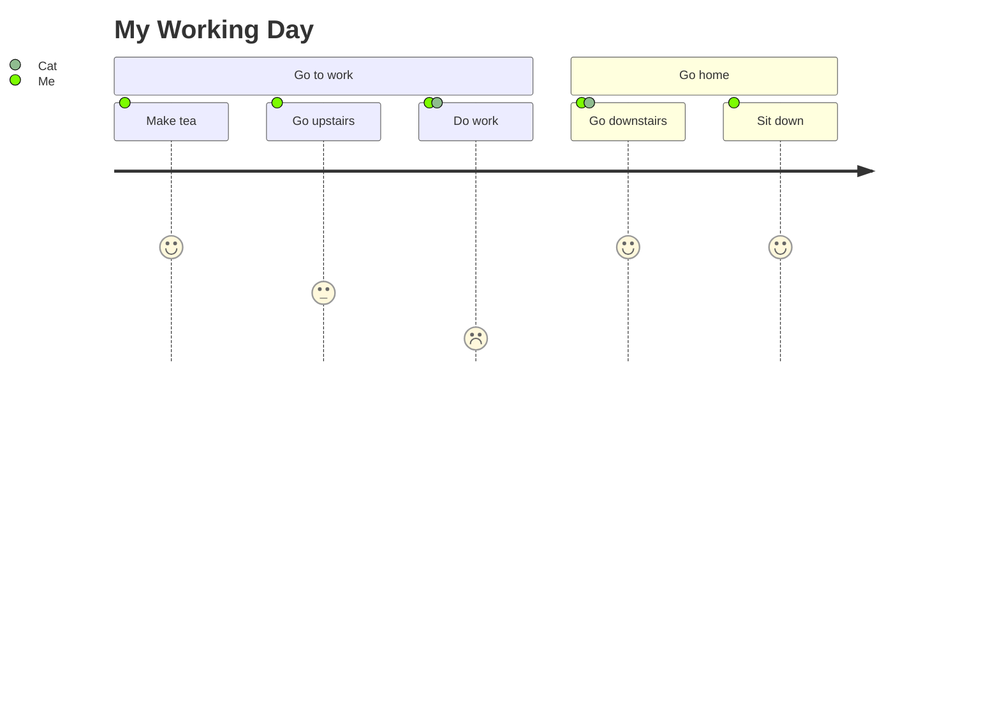

详细描述不同用户完成特定任务采取的步骤，显示当前用户的工作流，使用 `journey` 创建
- `title 标题`
- `section 工作组`
- `工作: 时间: 人员`，人员之间 `,` 分割

```mermaid
journey
title My Working Day
section Go to work
    Make tea: 5: Me
    Go upstairs: 3: Me
    Do work: 1: Me, Cat

section Go home 
    Go downstairs: 5: Me, Cat
    Sit down: 5: Me
```

#渲染异常 ：太大了显示不全