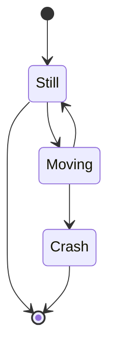
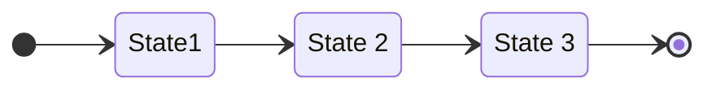
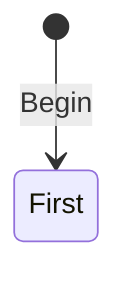
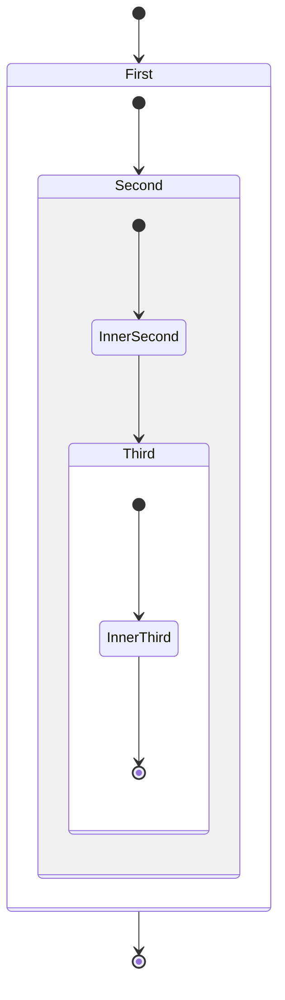
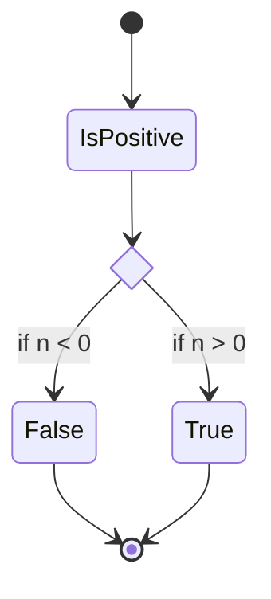
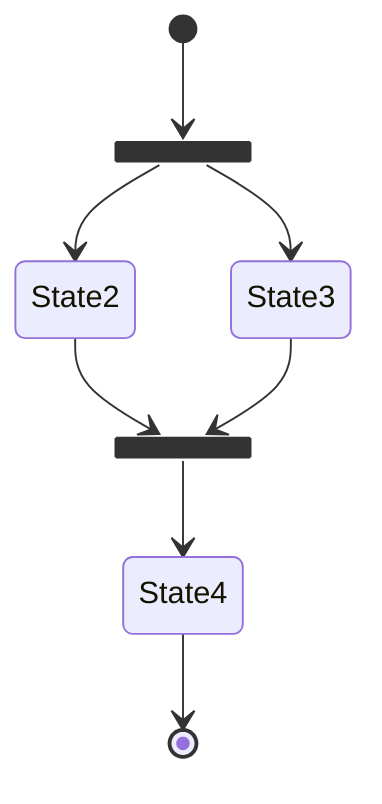
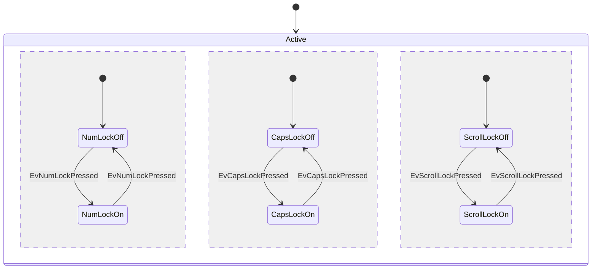
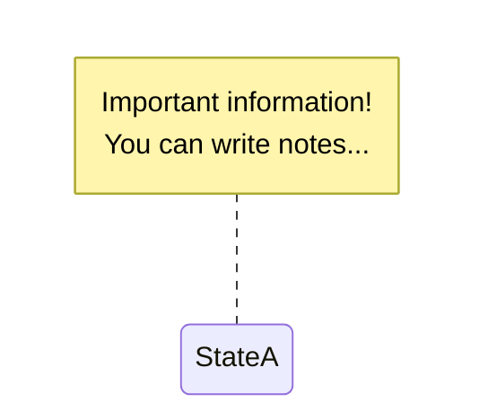

状态图通过 `stateDiagram` 或 `stateDiagram-v2` 创建，语法类似 `plantUml`
- `stateDiagram`

- `stateDiagram-v2`

渲染效果基本相同
# 方向

方向使用 `direction [方向]`，详见[[Mermaid 流程图 flowchat#方向]]
# 状态

状态定义可以有以下三种方法：
- `stateId`：当状态 id 与显示内容相同时，直接声明即可
- `state [描述信息] as [stateId]`，描述信息需要用 `""` 包围
- `[stateId]: [描述信息]`，此处描述信息不需要引号
- `[*]`：开始与结束，取决于位于箭头前还是箭头后

# 箭头

箭头表示状态的转移，使用 `状态1 --> 状态2 [: 信息]`

# 复合状态

复合状态指在一个状态中包含多个子状态，复合状态允许嵌套
```
state 复合状态名 {
  ...
}
```

# 判断

使用 `state 节点名 <<choice>>` 创建选择节点

# 分支

使用 `state [节点名] <<fork>>` 创建分支节点，`state [节点名] <<join>>` 创建合并节点

# 并行

使用 `--` 单独一行表示几个并行的任务

# 笔记

为某个节点添加笔记信息：
```
note [left/right] of [节点名]
信息...
end note
```

# 样式

自定义样式同样使用 [[Mermaid 流程图 flowchat#自定义样式#节点]] 实现