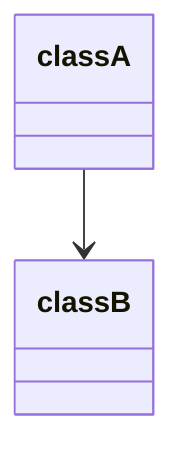
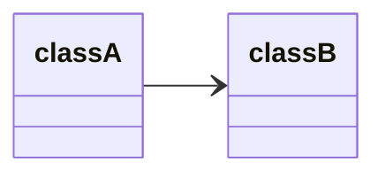
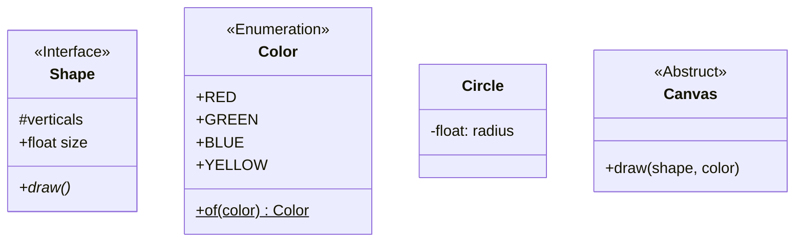
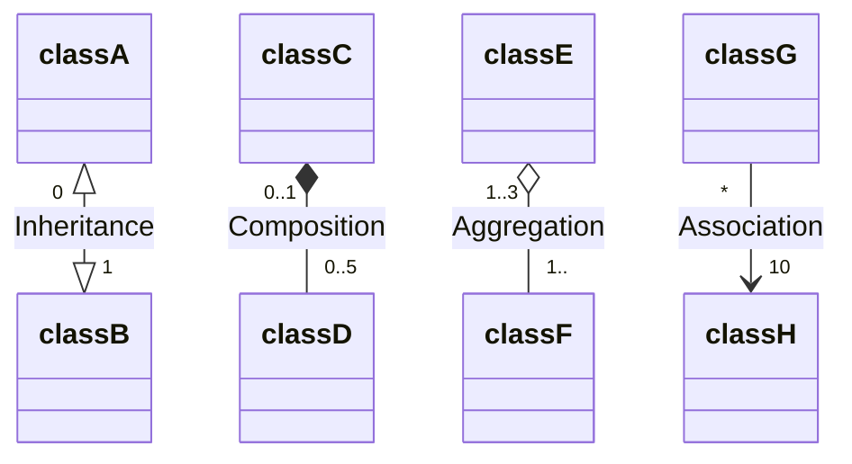
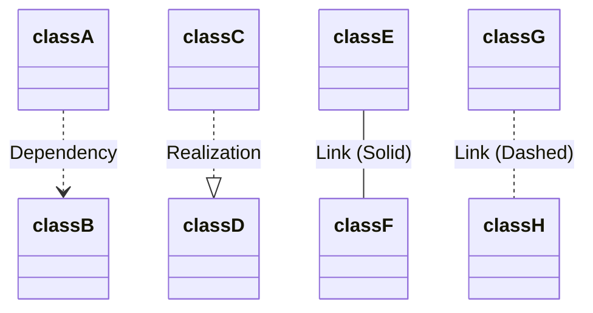
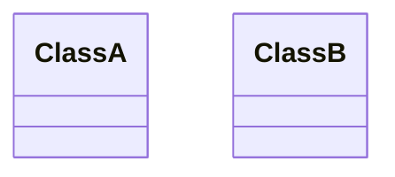
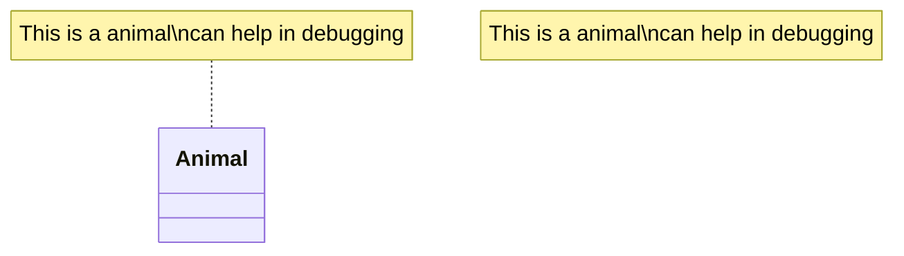

UML 中类图用于显示系统的类及其属性、运算和方法，以及与对象之间的关系，通过 `classDiagram` 定义，之后写类与对象的定义和关系即可

# 方向 direction

使用 `direction [方向]` 设置方向，详见[[Mermaid 流程图 flowchat#方向]]


# 类 class

UML 类图中的类由以下几部分组成：
- 头部，包含类名，样式居中加粗，首字母大写，可选包含一个类类型标记
- 中部，包含类的属性，左对齐，首字母小写
- 底部，包含类可以执行的操作，如运算和方法。左对齐，首字母小写

一个类通过 `class 类名` 定义，类成员有两种定义形式：
- 类名后跟一个大括号，大括号内包含类成员
- `类名:类成员`
```
class 类1 {
    [类类型标记]
    成员1
    成员2
    ...
}

class 类2
[类类型标记] 类2
类2: 成员1
类2: 成员2
...
```

类类型标记标记为文本加上 `<<>>` 包围，常用的包括：
- `<<Interface>>`：接口
- `<<Abstract>>`：抽象类
- `<<Service>>`：服务
- `<<Enumeration>>`：枚举

类成员包括
- 属性：`[访问修饰符]类型 属性名[附加修饰符]`
- 函数：`[访问修饰符]类型 函数名(参数列表)[附加修饰符] [返回值]` 
- 泛型：属性，函数，类名都可以包含泛型，泛型使用 `~泛型类型~`，显示为 `<泛型类型>`

访问修饰符包括
- `+`：public
- `-`：private
- `#`：protected
- `~`：package/internal

附加修饰符包括
- `*`：abstract，仅可以修饰函数
- `$`：static

# 关系

关系描述类与类、类与对象之间的逻辑关系：`[类1][基数1][箭头][基数2][类2][:文本描述]` 的格式：
基数：使用 `""` 包围，常见的包括：
- `"n"`：基数为 n
- `"0..n"`：介于 0 到 n
- `"1..n"`：介于 1 到 
- `"1.."`：至少为 1
- `"*"`：很多
箭头：*箭头可以有正/反/双向三种方向，这里只演示一种*
- `<|--`：继承
- `*--`：组合
- `o--`：聚合
- `-->`：协作

- `..>`：依赖
- `..|>`：实现
- `--`：连接（实线）
- `..`：连接（虚线）

# 交互

## 点击
*仅当 `scruityLevel='loose' 时允许调用函数`*

鼠标点击行为可以绑定某个 JS 方法或打开网页，形式包括以下三种：
- `[action] [className] "[reference]" "[tooltip]"`
- `click [className] call [callback()] "[tooltip]"`
- `click [className] href "[url]" "[tooltip]"`
其中变量为
- `[action]`：可选 `link` 或 `callback`，表示链接或函数
- `[className]`：类名
- `[reference]`：URL 链接或要调用的函数
- `[tooltip]`：可选，鼠标悬停的提示（但貌似没有显示？）
- `[callback()]`：调用的函数（没有语法错误但在 Obsidian 中无法执行）
- `[url]`：URL 链接

## 说明
#渲染异常 

使用 `note [for 类名] "..."` 表示对类的说明，文本中支持带有 `\n` 等换行和转义


# 样式

样式需要使用 CSS 设置，绑定样式类还是使用 `class 类名:::样式类` 或 `样式类 "类1,类2,..." 样式类`