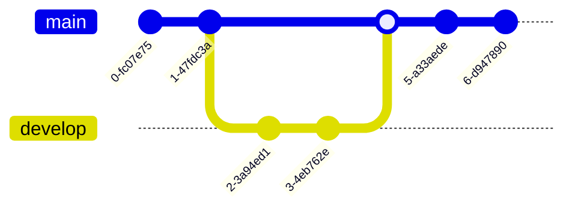
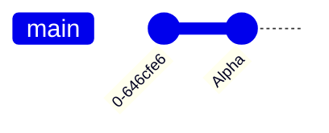

使用 `gitGraph` 创建，用于可视化 Git 流

# commit
`commit [id: "提交 id"] [type: 提交类型] [tag: "Tag"]`
- 提交 id：需要 `""` 包围，不添加则随机生成一串数字

- 提交类型：体现在 `commit` 上的圆点形状，不区分大小写
	- NORMAL：默认，实心圆形
	- REVERSE：回退提交，带 × 的实心圆形
	- HIGHLIGHT：特定提交，带填充的矩形

- Tag：Tag 需要 `""` 包围，在圆点顶部添加一个 `Tag` 图标

# branch

## branch

使用 `branch 分支名` 创建新分支并将当前分支设置为新分支。新分支名不能与现有分支重合，若分支名与关键字重合，则需要使用 `""` 包围
- order：分支排序，默认下主分支总在第一行，其他分支按出现顺序排序，通过该关键字进行排序

## checkout

使用 `checkout 分支名` 切换当前分支

## merge

使用 `merge 分支名` 将对应分支合并到当前分支，合并分支显示为填充的圆点。

`merge` 也支持 `id`，`tag`，`type`，其意义与[[#commit]]对应属性相同

# cherry-pick

允许使用 `cherry-pick id:"提交 id"` 将其他分支的对应提交合并到当前分支，但有限制：
- 对应提交 id 必须存在且不存在于当前分支
- 当前分支至少存在有一个提交

# 配置

- `showBranches`: 默认为 true，图中是否显示分支名

- `showCommitLabel`: 默认 true，图中是否显示提交 id

- `mainBranchName`: 默认 main，字符串，默认主仓库分支名称

- `mainBranchOrder`: 默认 0，数字，主分支排序，需要配合 `order` 使用

- `theme`：主题，可选为 `base`，`forest`，`dark`，`default`，`natural`，只是配色方案不同
#渲染异常 

- `themeVariables`：主题配置，通过该属性可以自定义主题颜色，字号等，需要指定主题为 `default`，颜色为以 `#` 开头的字符串
	- `git0` 到 `git7`：分支颜色，包括左侧分支名背景色及右侧线颜色
	- `gitInv0` 到 `gitInv7`：`HIGHLIGHT` 提交的方块边框颜色
	- `gitBranchLabel0` 到 `gitBranchLabel7`：左侧分支名颜色
	- `commitLabelColor`，`tagLabelColor`：提交 id 与 tag 标签文字颜色
	- `commitLabelBackground`，`tagLabelBackground`：提交 id 与 tag 标签背景颜色
	- `commitLabelFontSize`，`tagLabelFontSize`：提交 id 与 tag 标签字号
#渲染异常 

