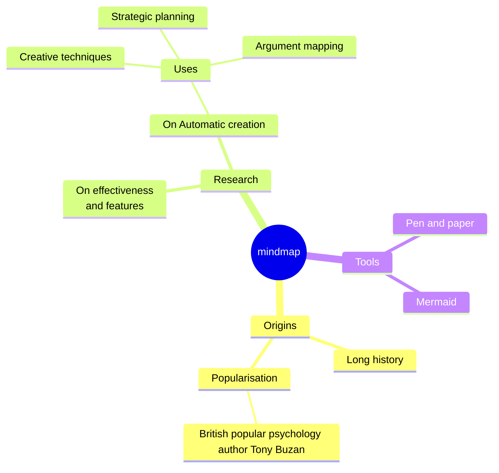

#实验性功能 #渲染异常  #未完成 

思维导图通过 `mindmap` 创建，Obsidian 暂不支持

```mermaid
mindmap
  root((mindmap))
    Origins
      Long history
      ::icon(fa fa-book)
      Popularisation
        British popular psychology author Tony Buzan
    Research
      On effectiveness<br/>and features
      On Automatic creation
        Uses
            Creative techniques
            Strategic planning
            Argument mapping
    Tools
      Pen and paper
      Mermaid
```

[Mindmap | Mermaid](https://mermaid.js.org/syntax/mindmap.html)
