> 时序图用以描述流程之间如何运作，以何种顺序运作

时序图以 `sequenceDiagram` 开头，换行后接每一个子语句
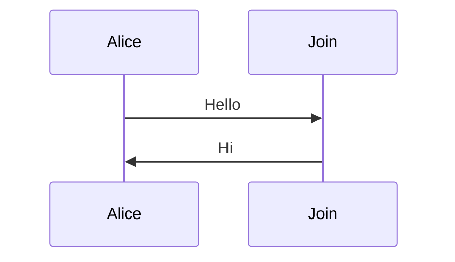
# 成员 participant actor

参与者 `participant` 和演员 `actor` 是时序图的成员类型，可以显式定义，或者直接用相当于隐式声明。如果隐式声明，参与者出现的顺序以之后出现的顺序为准：`participant/actor id[ as text]`
- `participant` 渲染成一个方块，`actor` 渲染成一个人形
- 若 `id` 与显示名相同，可省略，否则使用 `as`
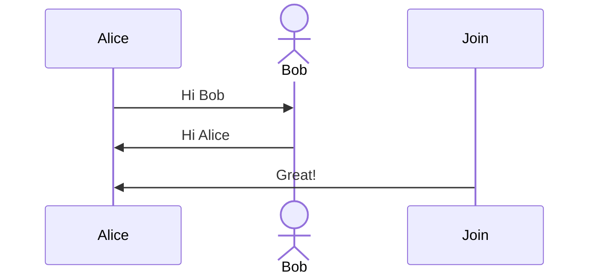
# 消息

成员之间的通信以 `成员1 箭头 成员2: 信息` 的形式声明
- 成员：参与者 `participant` 或演员 `actor` 的 `id`
- 箭头：有效的箭头，从 成员1 出发，指向 成员2
| 箭头 | 描述            |
| ---- | --------------- |
| ->   | 实线无箭头      |
| -->  | 虚线无箭头      |
| ->>  | 实线箭头        |
| -->> | 虚线箭头        |
| -x   | 实线箭头，带有× |
| --x  | 虚线箭头，带有× |
| -)   | 实线箭头，异步  |
| --)  | 虚线箭头，异步  | 
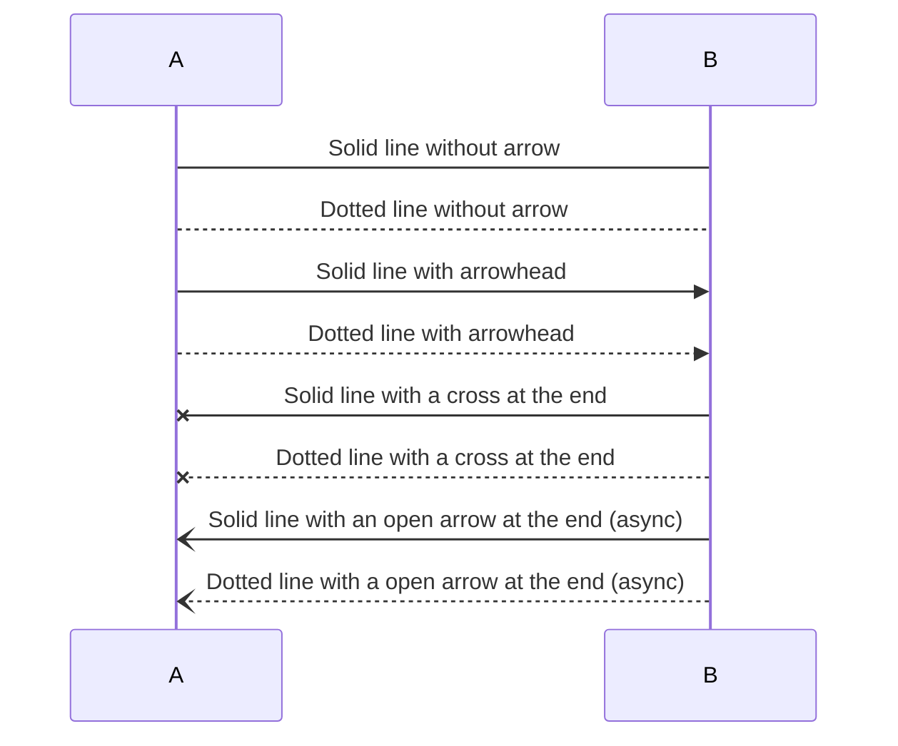
# 激活 activate

可以通过 `activate` 和 `deactivate` 激活和取消激活一个成员
- `activate` 可以简化成一个 `+`，`deactivate` 可以简化成 `-`
- 激活可嵌套
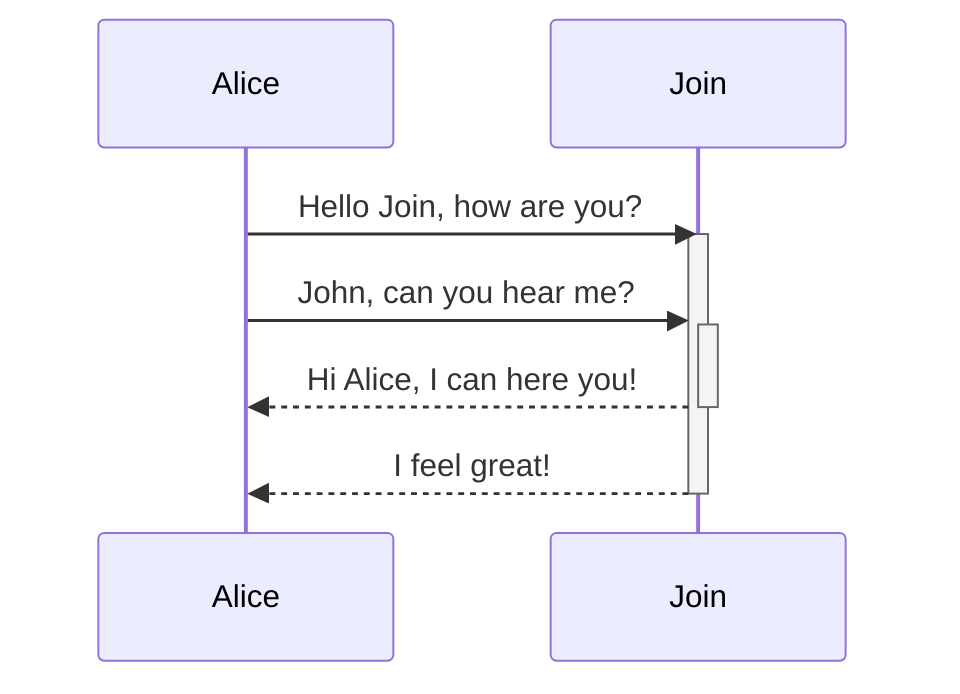
# 笔记 note

通过 `Note 位置 成员: 信息` 的形式添加笔记信息
- 成员可以是 `actor` 或者 `participant`
- 位置有两种：
	- `right of`，`left of`：当前成员做在线的右侧或左侧
	- `over`：`over` 后的成员需要有两个，以 `,` 分割，位于两个成员上一条消息之下
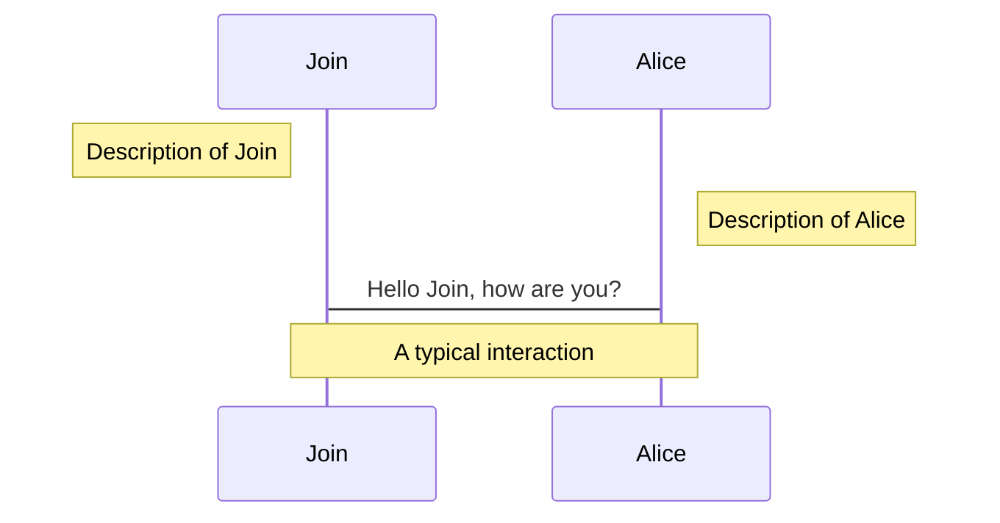
# 循环 loop

循环域通过以下格式创建：
```
loop [Loop text]
消息
end
```
创建后，形成一个虚线框，以 `loop` 标记
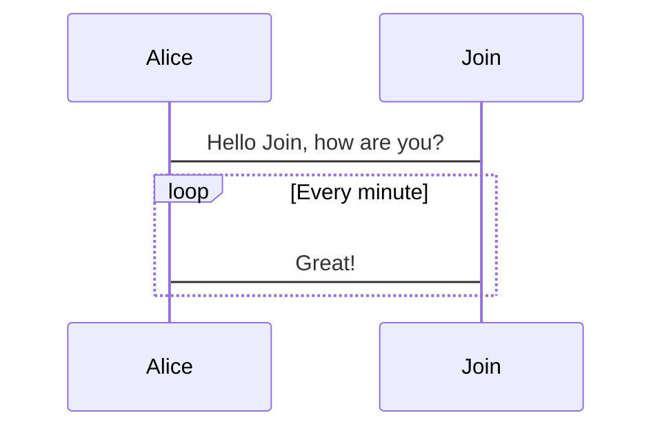
# 选择 alt, opt

`alt` 类似 `if` 分支，表示可能的几种情况，使用 `else` 创建分支：
```
alt [msg1]
...
else [msg2]
...
end
```
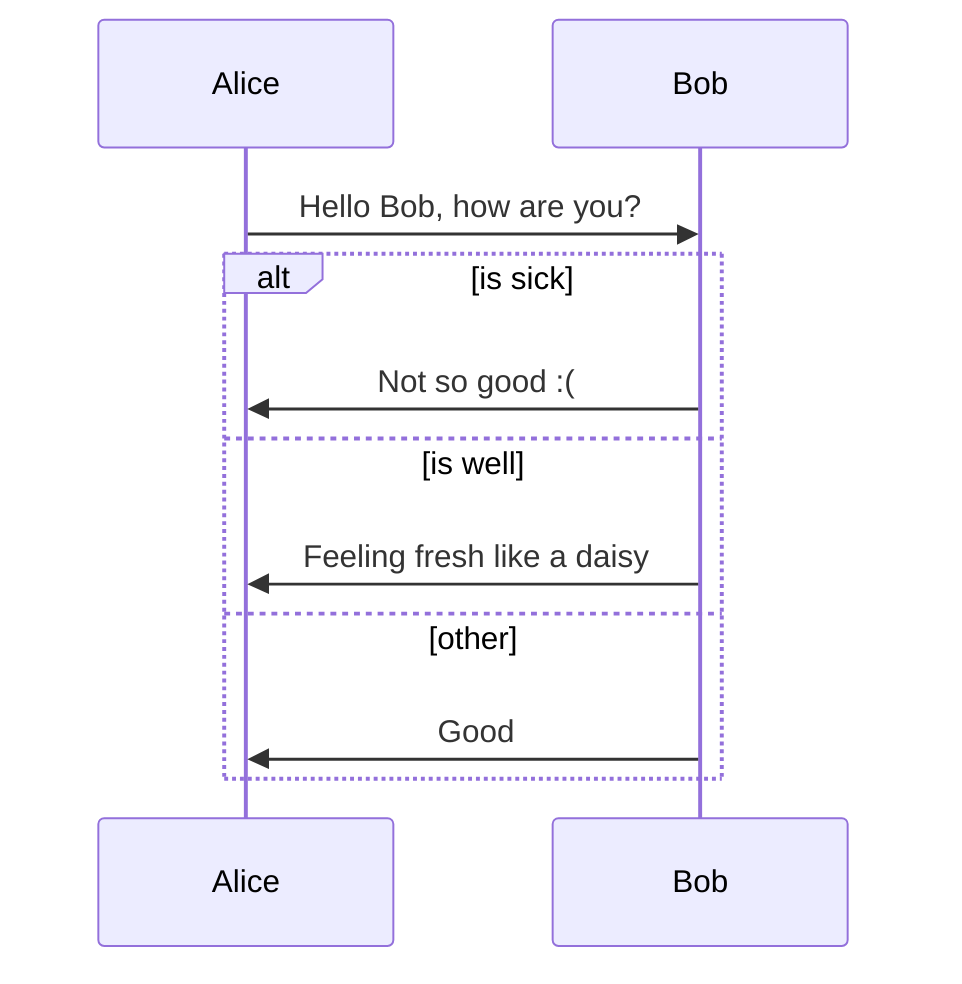
`opt` 表示可选的回复，格式为：
```
opt [extra response]
...
end
```
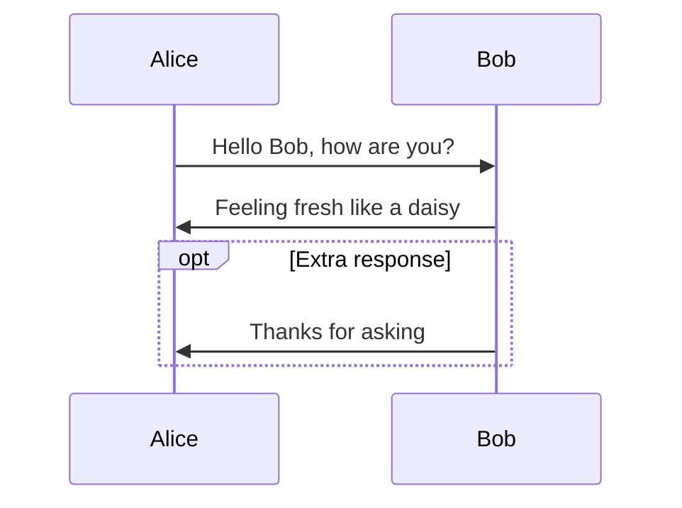
# 并行 par

表示并行执行的任务，支持嵌套，格式为：
```
par [Action 1]
...
and [Action 2]
...
and [Action N]
...
end
```
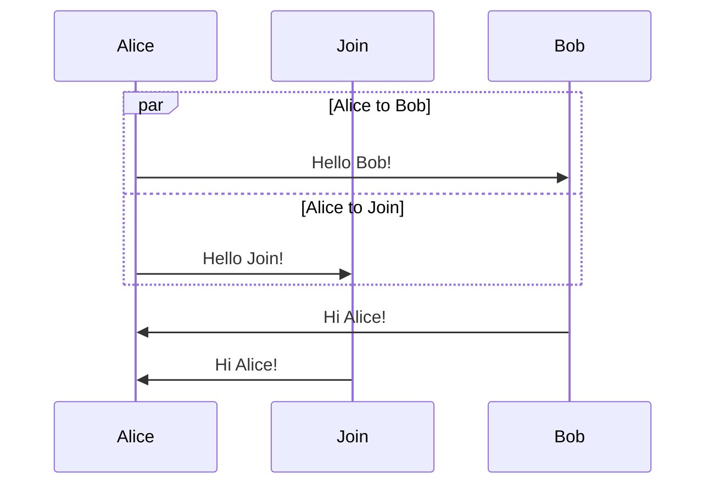
# 关键 critical

必须自动执行的重要事件，类似 `try-catch` 块的意义
```
critical [Action]
...
option [Circumstance A]
...
option [Circumstance B]
...
end
```
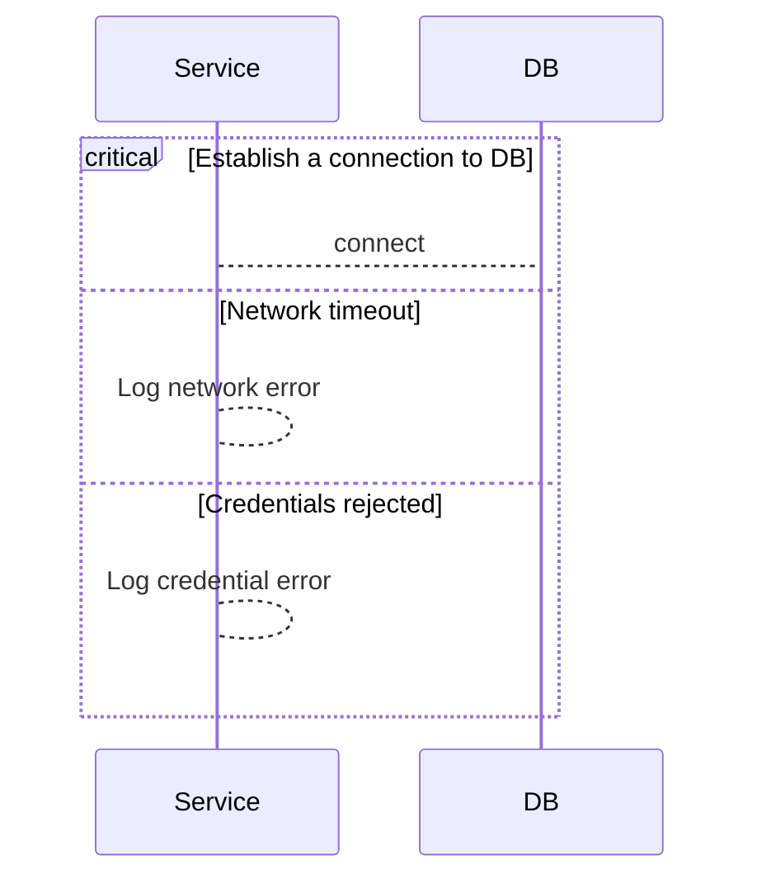
# 打断 break

表示异常情况使流程停止
```
break [something happened]
...
end
```
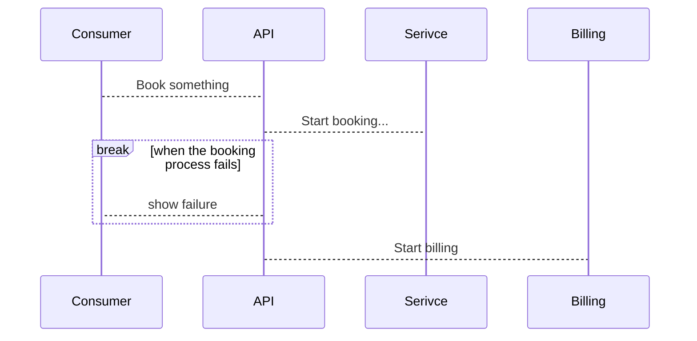
# 高亮 rect

使用 `rect` 高亮部分消息
```
rect rgb([0,255], [0,255], [0,255])
...
end

rect rgba([0,255], [0,255], [0,255], [0.0,1.0])
...
end
```
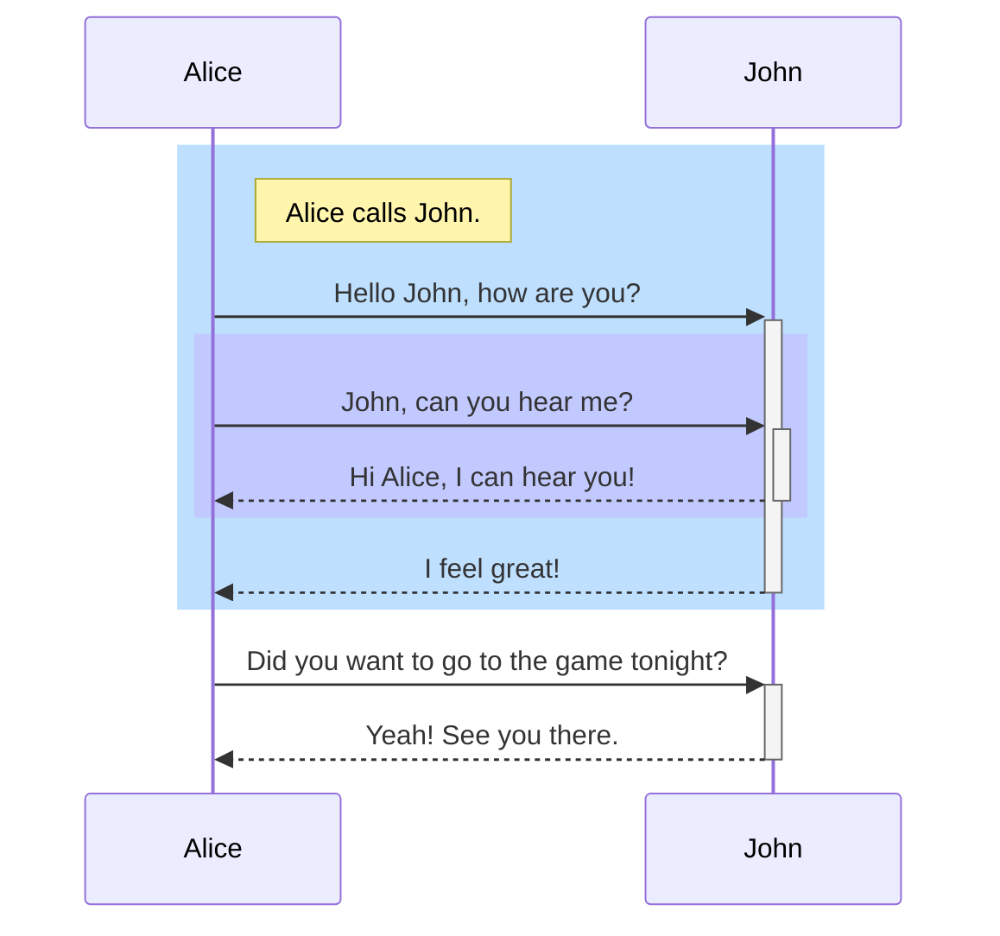
# 转义字符
#渲染异常 

使用 `#x;` 表示一个特殊符号，`x` 为一个数字，十进制，`#` 编号为 10，也支持 HTML 字符名
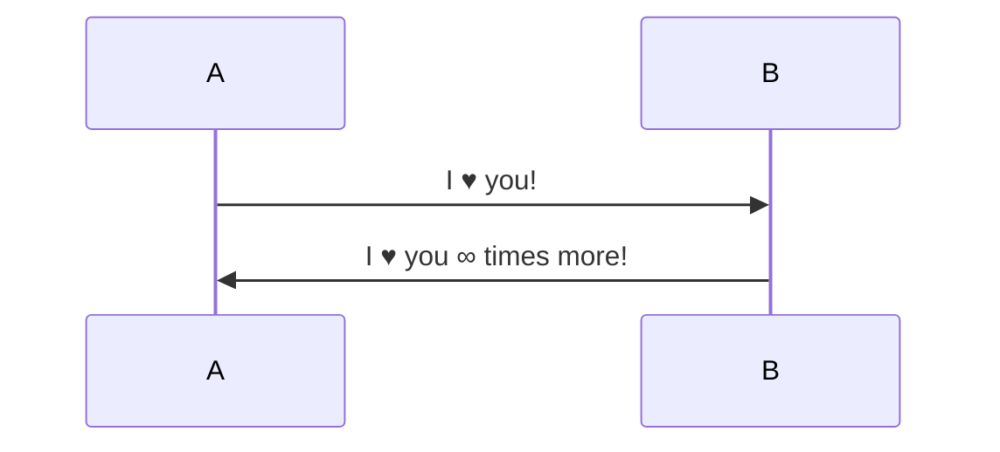
# 消息编号 autonumber

通过 `autonumber` 开启为消息增加自动编号，或通过 JavaScript 设置全局开启。

编号在消息起点的那个圆点上，可能看不太清
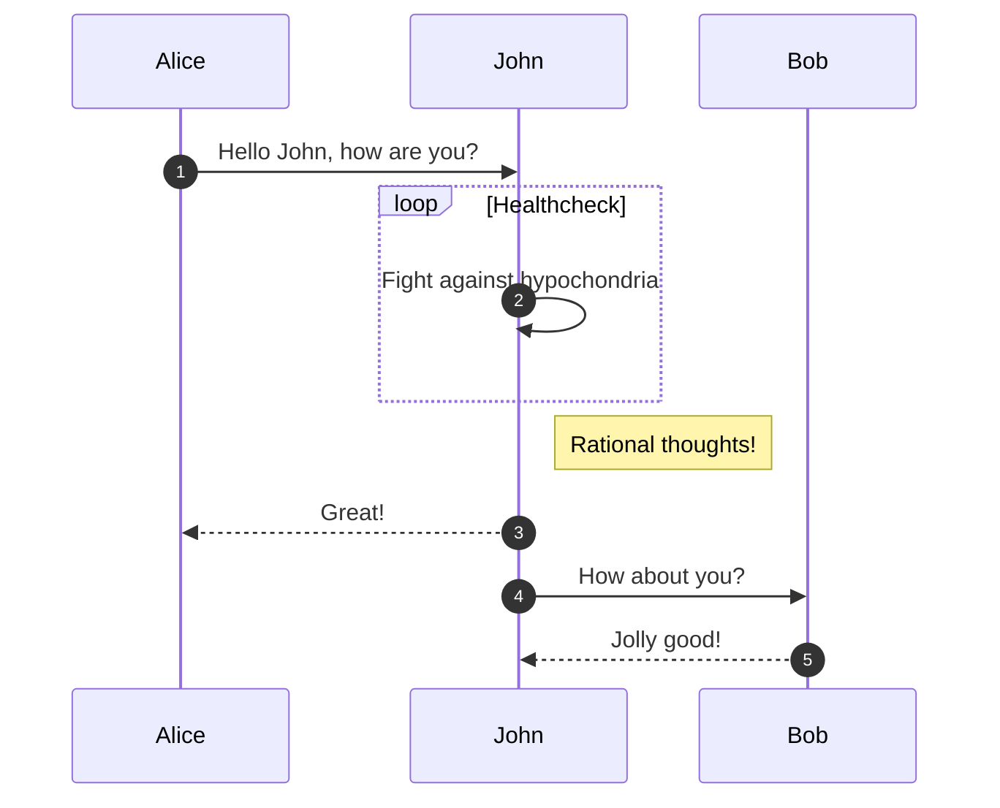
# 菜单 link

通过 `link 成员: 标签 @ 地址` 创建菜单，当鼠标放在顶部框时显示
也可以通过 `links 成员:标签集` 设定，标签集为一个 Json 对象，key 为标签，value 为地址
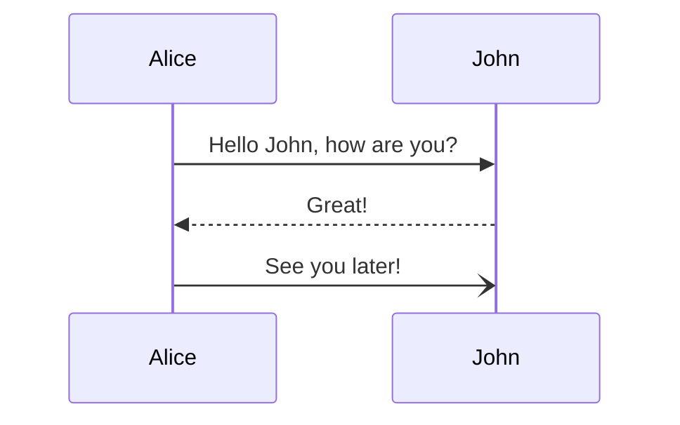
