流程图以 `graph` 或者 `flowchat` 开头，后接方向，剩下每一行描述一个节点或节点之间的关系：

```
graph/flowchat [方向]
[节点]
[节点 关系 节点...]
```

# 方向

流程图绘制方向，包括
- 自上而下：TB 或 TD，默认
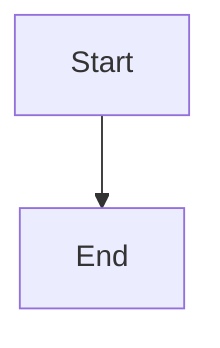
- 自下而上：BT
- 自右向左：RL
- 自左向右：LR


# 节点

## 矩形

- 直接使用内容即可创建一个矩形节点，节点 id 和显示的文本相同

- `节点id[显示内容]`

## 圆角矩形

圆角矩形通过 `id(节点内容)` 创建

## 胶囊

胶囊型通过 `id([节点内容])` 创建

## 圆柱形

圆柱形通过 `id[(节点内容)]` 创建
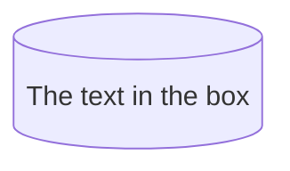
## 圆形

圆形通过 `id((节点内容))` 创建，`id(((节点内容)))` 则为双线边框（显示为较大的圆形）
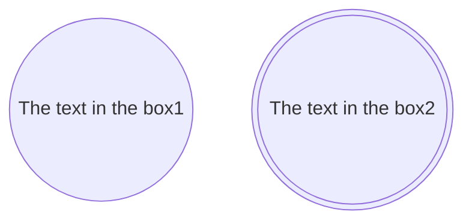
## 旗帜

旗帜形通过 `id>节点内容]` 创建

## 正方形（45°倾斜）

正方形通过 `id{节点内容}` 创建
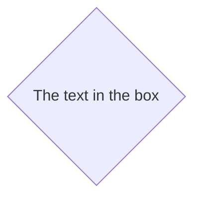
## 六边形

六边形通过 `id{{节点内容}}` 创建

## 平行四边形

平行四边形通过 `id[/节点内容/]` 和 `id[\节点内容\]` 创建，括号内斜杠方向为倾斜方向
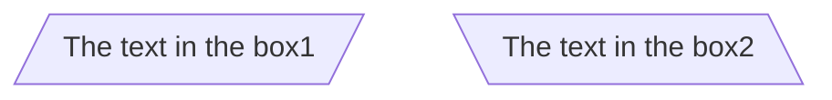
## 梯形

梯形通过 `id[\节点内容/]` 和 `id[/节点内容\]` 创建，括号内斜杠方向为倾斜方向
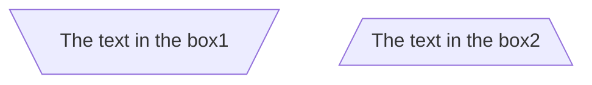
## 子程序
#渲染异常 

子程序通过 `id[[节点内容]]` 创建

# 关系

节点之间的关系体现在节点间的连接方式，节点之间连接由线型、箭头、文本三部分组合而成，
- 线型分为四种：实线 `-`，粗实线 `=`，点线 `-.-`
- 箭头分为三种：普通箭头 `>` 和 `<`，实心圆点 `o`，叉 `x`
- 组合规则：当线型为点线 `-.-` 时，带箭头的表述为 `-.->`，`<-.-` 或 `<-.->`，其余类型则表述为类似 `<-->`，`<--`，`-->` 的形式
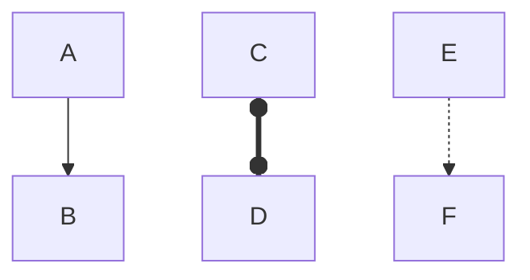
- 长度规则：默认长度为 1，点线每增加一个 `.`，其他类型每增加一个字符，长度增加 1 单位
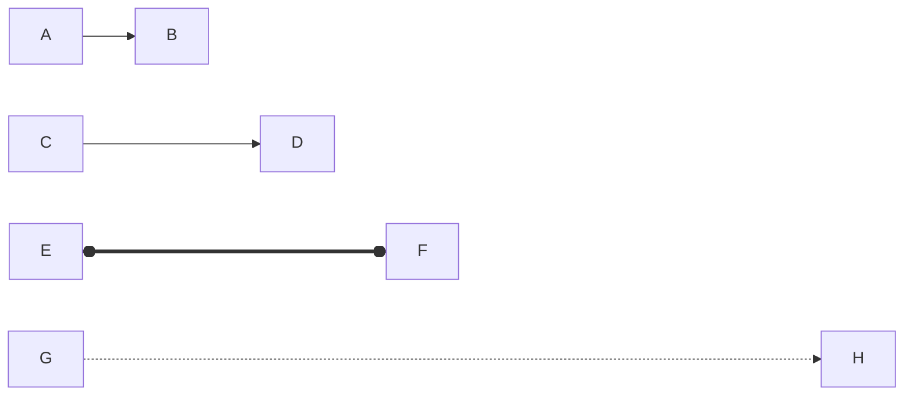
- 文本规则：增加文本描述信息有两种方法：
	- 在完整的连接描述后加 `|文本信息|` 形成形如 `-->|text|` 的形式
	- 在连接前增加两个字符，中间夹带描述，描述前后空格隔开；点线前加 `-.`，后省略一个 `-`，形成形如 `-- text -->` 和 `-. text .->` 的形式
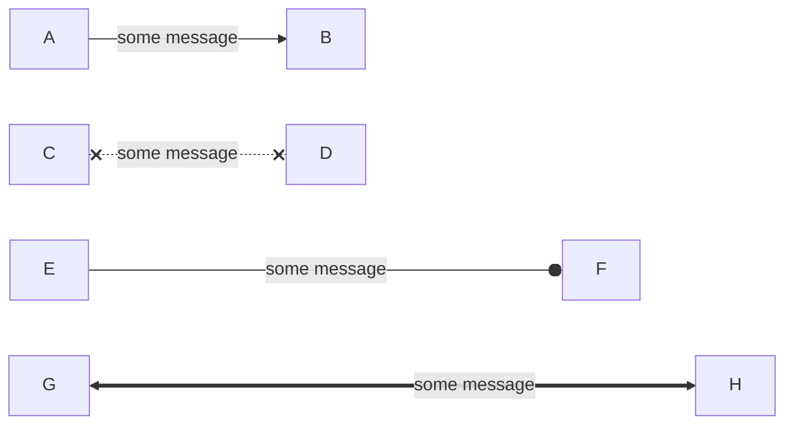

# 关系链

关系链由两个节点和中间的关系组成，可以分多行描述
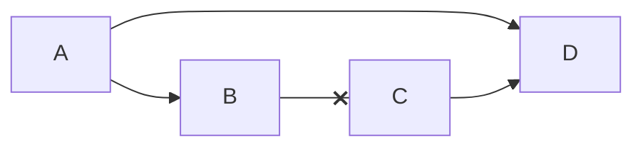
一条关系链也可以放在一行链式描述，允许成环
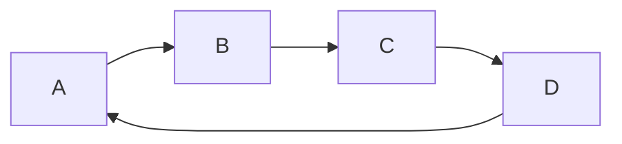
若有节点可以同时被访问到，可以使用 `&` 连接：
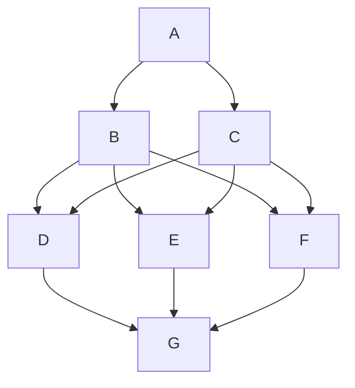
# 子图

允许通过子图将图分类，其语法为：
```
subgraph [id] [[标题]]
[定义]
end
```
- 子图标题可选，其外围应以中括号包围，若省略则与 `id` 一致。
- 子图允许嵌套，子图中的元素也允许互相连接
- 子图 id 允许通过关系实现与节点或其他子图相连接
- 子图定义可以包含以下内容：
	- 正常的图定义
	- 方向：`direction [方向]`，方向详见 [[#流程图 flowchart#方向]] #渲染异常
```mermaid
flowchart TB
Start[start]
End[end]
Start --> a2
Start --> bc1
Start --> GraphBC --> End
subgraph one [GraphA]
a1 --> a2
end

subgraph GraphBC
direction LR
bc1 --> b1
bc1 --> c2
    subgraph GraphB
    direction BT
    b1 --> b2
    end
    
    subgraph GraphC
    direction RL
    c1 --> c2
    end
end
```
# 交互

指点击节点的行为
- 调用某个 JS 函数：`clieck [id] [function]` 或 `click [id] call [function()]`
- 跳转到某个网页：`click [id] ["url"] ["message"] [target]`，`target` 可选为 `_self`，`_blank`，`_parent`，`_top`
```mermaid
flowchart
A
click A "https://www.baidu.com" "Go to Baidu"
```
由于 Markdown 中无法写入 JS，调用 JS 函数也无从谈起了
由于在 IDE 中查看 Markdown，`target` 也用处不大了

# 自定义样式

## 曲线

曲线样式默认为 `basis`，可选为以下值，详见 [[d3-shape#Curves]]

> `basis`，`bump`，`linear`，`monotoneX`，`monotoneY`，`natural`，`step`，`stepAfter`，`stepBefore`

在图开头使用 `%%{ init: { 'flowchart': { 'curve': 曲线样式 } } }%%` 设置
```mermaid
%%{init:{'flowchart':{'curve':'bump'}}}%%
flowchart LR
A --> B & C --> D & E
```
```mermaid
%%{init:{'flowchart':{'curve':'step'}}}%%
flowchart LR
A --> B & C --> D & E
```
## 线型

线型通过在图中使用 `linkStyle [序号] 样式;`
- 序号为一个从 0 开始的索引，表示定义的第 n 条线；使用 `default` 表示所有未设置的线
- 样式之间使用 `,` 分割，其他类似内嵌 CSS 样式
```mermaid
flowchart LR
A --> B & C --> D & E
linkStyle default stroke:blue,stroke-width:6px;
linkStyle 0 stroke:#ff3,stroke-width:4px,color:red;
linkStyle 1 stroke:#f3f,stroke-width:2px,color:green;
linkStyle 2 stroke:#3ff,stroke-width:1px,color:yellow;
```
## 节点

## id 样式

节点样式可以通过 `id` 设置：`style 节点id 样式`
```mermaid
flowchart LR
id1(Start) --> id2(End)
style id1 fill:red,stroke:green,stroke-width:4px
style id2 color:yellow
```
## 样式类

可以创建相应的样式类后绑定到节点上
- 使用 `classDef 类名 样式` 定义节点类，或在支持 CSS 的环境中，使用 CSS 的类选择器创建
- 使用 `节点:::类名` 将样式类绑定到某个节点上，或通过 `class 节点1,节点2,... 类名` 将样式类绑定到多个节点上
- `default` 样式类为所有节点的默认样式
```mermaid
flowchart LR
A[Start] --> B[Middle]:::style2 --> C[End]
A --> D[Default] --> C
classDef default fill:black
classDef style1 color:red,fill:green;
classDef style2 color:green,fill:white;
class A,C style1
```
# fontawesome
#渲染异常 

`Mermaid` 支持 `fontawesome` 字体图标，使用 `fa:icon` 引用
```mermaid
flowchart
B["fa:fa-twitter for peace"]
B --> C[fa:fa-ban forbidden]
B --> D(fa:fa-spinner)
B --> E[(A fa:fa-camera-retro perhaps?)]
```
