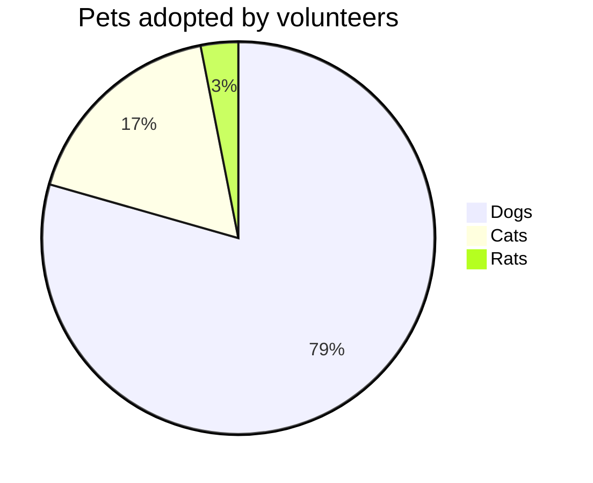

饼图使用 `pie` 创建
```
pie [showData] [title [标题]]
"[项]": [值]
"[项]": [值]
"[项]": [值]
...
```
- `[showData]`：可选，添加后会在右面显示每一项的值
- `[title]`：可选，标题，在饼图顶部居中显示
- `[项]`：饼图中每一项的名称，应通过 `""` 包围
- `[值]`：饼图中每一项的值，应当为正数


