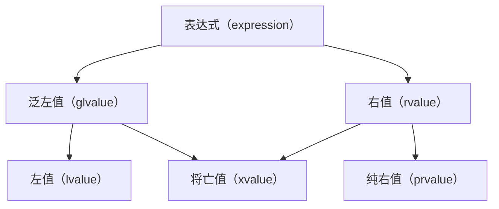

引用可以看成其他对象的别名。引用常用于方法传参，可防止对象复制

使用 `&` 声明，该 `&` 不是指针的取址符，而是表示引用类型
# 值类别

左值与右值的概念在 c++98 时期就出现了。左值一般是指一个指向特定内存的具有名称的值，具有一个稳定的内存地址。右值指向不稳定内存地址的匿名值，通常是暂时的，生命周期很短。

有一个很简单的判断方法，使用 `&` 取值后，可以正常编译取到地址的就是左值。
* `++i` 与 `i++`：`++i` 是左值，返回的变量是 i，具有稳定的内存地址；`i++` 是右值，返回的是对原来 i 的一个副本
* 函数：函数形参是左值，但返回值是右值
* 字面量：一般数值的字面量都是右值，但字符串字面量是左值（是一个数组）

#cpp11 值类别用于描述表达式的属性， #cpp17 进行清晰的区分：



> [!note] 
> - 泛左值：通过评估能确定对象、位域或函数的标志的表达式，即具名对象，C++98 的左值
> - 右值：即 C++98 的右值
> - 将亡值：表示资源可被重用的对象和位域，是泛左值与右值的交集
> 	- 使用移动语义将泛左值转换为右值引用
> 	- #cpp17 临时量实质化：纯右值转换为临时对象
> - 纯右值：通过评估能用于初始化对象和位域，或能计算运算符操作数的值的表达式
> - 左值：非将亡值的泛左值

```c++
struct S {
    int a;
};

int main() {
    // S() 产生一个纯右值
    // 访问成员四 a 需要一个左值
    // 此时将创建 S() 临时变量，该量为将亡值
    int b = S().a;
}
```
## lvalue

左值引用一个变量的持久性位置，**lvalue 完全等价于被引用值**

```c++
long number {10};
long &rnumber {number};
rnumber += 10L;
// ref=20, val=20 -- 引用类型值变化，原数据值也会变
cout << "ref=" << rnumber << ", val=" << number << endl;
// ref type=l -- 引用类型与原数据类型相同
cout << "ref type=" << typeid(rnumber).name() << endl;
```

对于常量，则应当使用常引用

```c++
const int &rvalue {5};
```

对于可能导致数据复制的情况，应尽量使用引用，以减少对象的复制，如增强 for 循环，函数传参等

```c++
double values[] {1, 2, 3, 45, 6};
// 若为 auto value，即 double value，会进行一次数据复制
for (auto &value: values) {
    // do something
}

// 使用 const 可避免数据被修改
for (const auto &value: values) {
    // do something
}
```
## rvalue

临时对象，又称右值，`R-value`，因其常位于赋值运算符右侧而得名。

#cpp03 右值无法被改变，通常等效于 `const T&`。

#cpp11 引入右值引用类型，是一种非常量引用，标记为 `T&&`，用于绑定临时对象，允许对象右值引用在初始化之后进行修改，主要为了实现 move 语义。

右值引用的作用是延长右值的存在时间。一般来说，右值在使用后直接销毁；而存在右值引用时，直到引用被销毁后右值才被销毁。

```run-cpp
class X {
public:

    X() {
        cout << "X 默认构造\n";
    }

    X(const X& x) {
        cout << "X 复制构造\n";
    }

    void show() {
        cout << "Show X\n";
    }
};

X make_x() {
    X x;
    return x;
}

int main() {
    X x = make_x();
    x.show();
    return 0;
}
```

以上代码在 `X x = make_x()` 时产生了三次构造函数调用
1. `X x;` 调用无参构造创建对象
2. `return x;` 调用复制构造创建用于返回的临时变量
3. `X x = ...` 调用复制构造将临时变量复制给 x 变量

> [!note] 测试平台 g++.exe (x86_64-posix-seh-rev1, Built by MinGW-Builds project) 13.2.0

> [!warning] 使用了 `-fno-elide-constructors` 配置选项，经测试实际只调用了两次构造，可能新平台有其他优化

将 main 函数中 x 的类型更改为 `X&&`，如：

```c++
// ...

int main() {
    X &&x = make_x();
    x.show();
    return 0;
}
```

之后调用只会产生两次构造。x 接收的是一个右值引用，延长了 `make_x()` 产生的右值的生命周期，不需要通过复制构造产生第二个对象。
# move 语义

C++ 无法将一个右值赋给左值引用的变量，但可以将一个左值通过强制转换为一个将亡值，而将亡值也同时属于右值，此时可以将其赋给一个右值引用。

此时该变量与之前的变量有相同的生命周期和内存地址。

```c++
int i = 10;
int &&k = static_cast<int&&>(i);
```

`std::move` 负责将左值转换成右值引用，其实际实现就是一个类型的强制转换，将一个左值转换为右值（将亡值）。

该功能的作用主要是使一个左值使用移动语义：

```c++
// 一个具有移动构造的类型，包含一块内存数据的指针
BigMemoryPool value;
// 该操作调用的是 BigMemoryPool 的复制构造 
BigMemoryPool value1 = value;
// 该操作调用的是 BigMemoryPool 的移动构造 
BigMemoryPool value2 = std::move(value);
```

使用场景为在一个右值被转换为左值，又需要再次转换为右值的情况，主要在函数传参。

> [!warning] 无论函数形参是左值还是右值，传入的实参都是左值。
# forward 语义

`std::forward` 可以将右值引用转换成左值引用，实际也是一个类型强转。
# 完美转发

使用右值引用，函数重载可以区分左右值。但出于安全考虑，具名变量被称为左值，因此作为右值传入的值使用时也成为了左值。

若该函数是作为一个中间函数将值向下一个函数传递，我们希望右值被传递到右值，但默认行为并非如此：

```run-cpp
void b(int &&b) {
    cout << "b&&=" << b << endl;
}

void b(int &b) {
    cout << "b&=" << b << endl;
}

void a(int &&a) {
    cout << "a&&=" << a << endl;
    b(a);
}

void a(int &a) {
    cout << "a&=" << a << endl;
    b(a);
}

int main() {
    int v = 10;
    // a&=10
    // b&=10
    a(v);
    // a&&=10
    // b&=10 -- 预期应该是 b&&=10
    a(10);
    
    return 0;
}
```

利用 `std::move`，可将右值直接传递给接收右值的函数，实现完美转发

```run-cpp
void b(int &&b) {
    cout << "b&&=" << b << endl;
}

void b(int &b) {
    cout << "b&=" << b << endl;
}

void a(int &&a) {
    cout << "a&&=" << a << endl;
    b(std::move(a)); // 这里用了 move 语义
}

void a(int &a) {
    cout << "a&=" << a << endl;
    b(a);
}

int main() {
    int v = 10;
    // a&=10
    // b&=10
    a(v);
    // a&&=10
    // b&&=10
    a(10);

    return 0;
}
```
# 万能引用
#cpp11

`const T&` 可以同时匹配左值和右值引用。但由于其 `const` 限制，使用场景有一定的限制。

模板 + `T&&` 匹配所有类型引用，称为万能引用：

```c++
//  万能引用
template<typename T>
void foo(T&& v) {
    // do something
}

int main() {
    int i = 5;
    // 匹配左值引用
    foo(static_cast<int&>(i));
    // 匹配右值引用
    foo(static_cast<int&&>(i));
    return 0;
}
```

万能引用主要是通过引用折叠实现：
* 只要有一个左值引用，结果就是左值引用
* 当一个是右值引用，另一个是非引用或右值引用，结果是右值引用

|T|T&|T&&|
| -----| :---| :----|
|R|R&|R&&|
|R&|R&|R&|
|R&&|R&|R&&|


