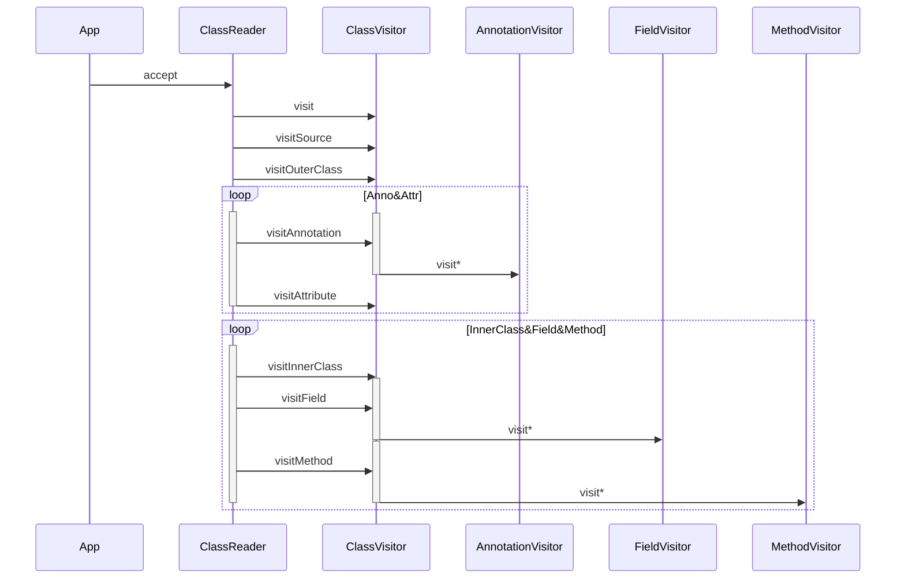

ASM API 分为基于事件触发的 Core API 和基于对象操作的 Tree API，可类比 XML 解析的 SAX 和 DOM 解析。核心是 Core API

![[../../../../_resources/images/ASM 2024-08-02 11.12.29.excalidraw]]

`asm-commons` 则提供了一系列辅助类和方法，如 AdviceAdapter 可以更方便的修改函数
# CoreAPI

> [!note] Maven 库：`org.ow2.asm:asm`

在使用 CoreAPI 时，最重要的三个类是 `ClassReader`，`ClassVisitor`，`ClassWriter`。

`ClassReader` 是字节码读取和分析引擎，负责解析 class 文件，采用类似 SAX 的方式，在事件发生时触发相对的 `ClassVisitor`、`MethodVisitor` 等处理器

`ClassVisitor` 是一个抽象类，在 `ClassReader.accept()` 处使用。`ClassReader` 在读取不同节点<sup>（调用顺序： [visit] 1次 [visitSource] 0或1次 [visitOuterClass] 0或1次 [visitAnnotation | visitAttribute] 任意次 [visitInnerClass | visitField | visitMethod] 任意次 [visitEnd] 1次）</sup>时会调用 `ClassVisitor` 的不同 `visitor` 方法。

> [!note] 调用顺序
> 1. `visit` 1次
> 2. `visitSource` 0或1次
> 3. `visitOuterClass` 0或1次
> 4. `visitAnnotation` / `visitAttribute` 任意次
> 5. `visitInnerClass` / `visitField` / `visitMethod` 任意次
> 6. `visitEnd` 1次

`ClassWriter` 是 `ClassVisitor` 的一个实现类，增加了 `toByteArray` 方法可以直接获取 class 字节码数组

![[Pasted image 20240802111742.png]]

```` title:'Mermaid 显示不全' fold

````
## 实例

```reference title:源文件
file: "@/_resources/codes/bytecodes/asm/MyClass.java"
start: 3
```
### 输出类的方法和字段

``` title:预期结果
Field: a
Field: b
Method: <init>
Method: test01
Method: test02
```

```reference fold
file: "@/_resources/codes/bytecodes/asm/CoreAPI1.java"
start: 22
```

> [!note] `ClassReader` 的 `accept` 第二个参数 `flags` 是一个位掩码，可选以下值：

| 值             | 说明                     |
| ------------- | ---------------------- |
| SKIP_DEBUG    | 跳过调试信息（行号等）            |
| SKIP_CODE     | 跳过 Code 属性（方法字节码、异常表等） |
| EXPAND_FRAMES | 展开 StackMapTable 属性    |
| SKIP_FRAMES   | 跳过 StackMapTable 属性    |
### 新增字段和方法

> [!note] 通过 `visitXxx` 方法可以向类中增加元素。可以选择在 `visit()` 方法中添加，也可以选择在 `visitEnd()` 中添加。

`ClassVisitor` 构造函数第二个参数可以传入另一个 `ClassVisitor`，用于组合多个 `ClassVisitor`。这里传入了用于输出的 `ClassWriter` 对象

```java title:预期结果
public class MyClass {
    public int a = 0;
    public int b = 1;
    public static final String xyz;
    public void test01() {}
    public void test02() {}
    public void foo(int var1, String var2) {
        System.out.println(new StringBuilder()
                            .append(var1)
                            .append(var2)
                            .toString());
    }
}
```

```reference fold
file: "@/_resources/codes/bytecodes/asm/CoreAPI2.java"
start: 27
```
### 移除方法和字段，修改方法内容

若要删除一个元素，在 `visit` 方法中返回 `null` 即可。

若要添加或修改，在对应的 `visit` 方法返回修改后的 `MethodVisitor`。

`visitCode` 表示方法体中字节码的开始，`visitMaxs` 表示方法体中字节码的结束，`visitEnd` 为 `MethodVisitor` 中所有事件的结束。

```java title:预期结果
public class MyClass {
    public int a = 0;
    public void test01() {}
}
```

```reference fold
file: "@/_resources/codes/bytecodes/asm/CoreAPI3.java"
start: 27
```

> [!note] 调用顺序
> 1. `visitParameter` * n
> 2. `visitAnnotationDefault` 
> 3. `visitAnnotation` / `visitParameterAnnotation` / `visitAttribute` * n
> 4. `visitCode`
> 5. `visitFrame` / `visit?Insn` / `visitLabel` / `...` * n
> 6. `visitMaxs`
> 7. `visitEnd`

在修改方法后，我们可能需要重新计算操作数栈和局部变量表大小。除了使用 `visitMaxs()` 手动指定外，还可以在 `ClassWriter` 构造函数中传入参数让 ASM 自动计算

| `flags`          | 说明                                    |
| ---------------- | ------------------------------------- |
| 0                | 不自动计算操作数和局部变量表大小                      |
| `COMPUTE_MAXS`   | 自动计算操作数栈和局部变量表大小，但需要调用 `visitMaxs` 触发 |
| `COMPUTE_FRAMES` | 自动计算操作数栈、局部变量表、StackMapFrames 大小      |
# TreeAPI

> [!note] Maven 库：`org.ow2.asm:asm-tree`

TreeAPI 比 CoreAPI 用起来更方便，可以随时访问类的全部信息，但处理速度会慢 30% 左右，同时会消耗更多内存，应根据实际情况选择

TreeAPI 只需要向 `ClassReader` 的 `accept` 方法传入一个 `ClassNode` 类即可。`accept` 后，所有类信息都将保存到 `ClassNode` 中
## 实例

```reference title:源文件
file: "@/_resources/codes/bytecodes/asm/MyClass.java"
start: 3
```
### 输出类的方法和字段

```console
Field: a
Field: b
Method: <init>
Method: test01
Method: test02
```

```reference fold
file: "@/_resources/codes/bytecodes/asm/TreeAPI1.java"
start: 18
end: 27
```

  `ClassReader` 的 `accept` 第二个参数 `flags` 是一个位掩码，可选以下值：

|值|说明|
| ---------------| ----------------------------------------|
|SKIP_DEBUG|跳过调试信息（行号等）|
|SKIP_CODE|跳过 Code 属性（方法字节码、异常表等）|
|EXPAND_FRAMES|展开 StackMapTable 属性|
|SKIP_FRAMES|跳过 StackMapTable 属性|
### 新增字段和方法

```java title:预期结果
public class MyClass {
    public int a = 0;
    public int b = 1;
    public static final String xyz;
    public void test01() {}
    public void test02() {}
    public void foo(int var1, String var2) {
        // System.out.println(var1 + var2);
        System.out.println(new StringBuilder()
                            .append(var1)
                            .append(var2)
                            .toString());
    }
}
```

```reference fold
file: "@/_resources/codes/bytecodes/asm/TreeAPI2.java"
start: 19
end: 54
```

### 移除方法和字段，修改方法内容

```java title:预期结果
public class MyClass {
    public int a = 0;
    public void test01() {}
}
```

```reference fold
file: "@/_resources/codes/bytecodes/asm/TreeAPI3.java"
start: 19
end: 48
```
# AdviceAdapter

> [!note] Maven 库：`org.ow2.asm:asm-commons`

`AdviceAdapter` 继承自 `MethodVisitor`，可以方便的在方法的开头和结尾插入代码：
* `onMethodEnter`：在方法开头或构造器 `super()` 之后插入
* `onMethodExit`：在方法正常退出（每个 `RETURN` 类型指令）或异常退出（每个 `ATHROW` 指令）时插入
## 实例：添加 try-catch 结构

如果想给方法增加 `try-catch` 块，使用 `visitTryCatchBlock` 增加异常表，并通过 `Label` 对象定位。

```reference title:原始方法
file: "@/_resources/codes/bytecodes/asm/Foo.java"
start: 5
end: 9
```

```java title:目标方法
public void foo() {
    System.out.println("enter foo");
    try {
        System.out.println("Step 1");
        int a = 1 / 0;
        System.out.println("Step 2");
        System.out.println("normal exit foo");
    } catch (Exception e) {
        System.out.println("err exit foo");
        throw e;
    }
}
```

```reference fold
file: "@/_resources/codes/bytecodes/asm/UseAdviceAdapter.java"
start: 19
end: 77
```
